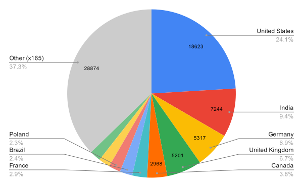
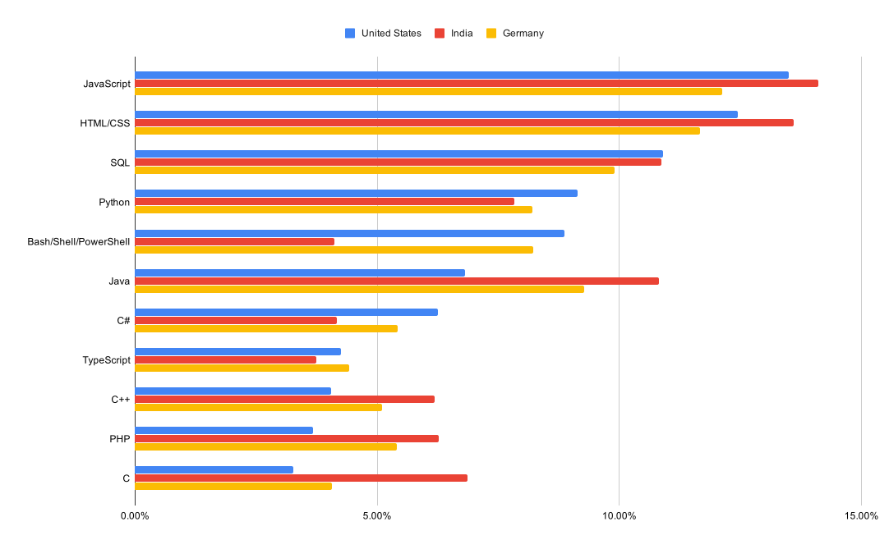

# kapp

# About

This document contains an outline of how I applied the SQL knowledge I gained on publicly available datasets.

# Table of Contents

<details open>
  <summary>Sections</summary>

  * [Approach](#approach)
  * [Results](#results)
  * [Key Takeaways](#key-takeaways)
</details>

# Approach

### General Workflow

1. In MySQL Workbench, create a new schema
1. Right-click the new schema and select the Table Data Import wizard
1. Import the survey_results_public.csv file from the desired Stack Overflow Developer Survey year
1. Run queries
1. Save results in a .csv file
1. Clean up data if needed
1. Plot results using Google Spreadsheets

# Results

Summary of my analysis

### 2019 Respondents by Country



TODO

```sql
select * from
(select country, count(*) count
from new_schema.survey_results_public
group by country
order by count(*) desc limit 10) t1
```

TODO

```sql
select "Other", count(*) "Number of Countries", sum(count) "Total Number of Responses"
from
(select country, count(*) as count
from new_schema.survey_results_public
group by country
order by count(*) desc) t1
left outer join
(select country, count(*)
from new_schema.survey_results_public
group by country
order by count(*) desc limit 10) t2
on (t1.country = t2.country)
where t2.country is null
```

<details>
  <summary>Results</summary>
  
  | country        | count |
  | -------------- | ----- |
  | United States  | 18623 |
  | India          | 7244  |
  | Germany        | 5317  |
  | United Kingdom | 5201  |
  | Canada         | 2968  |
  | France         | 2217  |
  | Brazil         | 1865  |
  | Poland         | 1766  |
  | Netherlands    | 1702  |
  | Australia      | 1652  |

  | Other | Number of Countries | Total Number of Responses |
  | ----- | ------------------- | ------------------------- |
  | Other | 165                 | 28874                     |
</details>
  
### Countries with the Most Respondents [2015-2019]

![Countries with the Most Respondents \[2015-2019\]](charts/countries-with-the-most-respondents-2015-2019.svg)

TODO

```sql
select 
  t2019.country,
  t2015.count,
  t2016.count,
  t2017.count,
  t2018.count,
  t2019.count
from (select country, count(*) count from (new_schema.survey_results_public) group by country order by count(*) desc limit 12) as t2019 
inner join (select country, count(*) count from (`2018`.survey_results_public) group by country order by count(*) desc limit 12) as t2018 
on t2019.country = t2018.country
inner join (select country, count(*) count from (`2017`.survey_results_public) group by country order by count(*) desc limit 12) as t2017
on t2018.country = t2017.country
inner join (select country, count(*) count from (`2016`.`2016 Stack Overflow Survey Responses`) group by country order by count(*) desc limit 12) as t2016
on t2017.country = t2016.country
inner join (select country, count(*) count from (`2015`.`2015 Stack Overflow Developer Survey Responses Revised`) group by country order by count(*) desc limit 12) as t2015
on t2016.country = t2015.country
```

<details>
  <summary>Results</summary>

  | Country        | 2015 | 2016 | 2017  | 2018  | 2019  |
  | -------------- | ---- | ---- | ----- | ----- | ----- |
  | United States  | 4745 | 4382 | 11455 | 20303 | 18623 |
  | India          | 2461 | 4079 | 5197  | 5880  | 7244  |
  | United Kingdom | 2403 | 3667 | 4395  | 6219  | 5201  |
  | Germany        | 1976 | 3332 | 4143  | 6459  | 5317  |
  | Canada         | 828  | 1476 | 2233  | 3393  | 2968  |
  | France         | 776  | 1326 | 1740  | 2570  | 2217  |
  | Netherlands    | 614  | 935  | 855   | 1841  | 1702  |
</details>

### Comparison of 2019 Technology Trends Between the Top 3 Respondents



TODO

```sql
select country, languageworkedwith
from new_schema.survey_results_public
where (country like 'united states' or country like 'india' or country like 'germany') and languageworkedwith not like 'NA' and languageworkedwith is not null
order by country
```

TODO

```python
from collections import Counter
import pprint
import sys

def parse(inputfile):
    counter = Counter()

    with open(inputfile, 'r') as f:
        next(f) # Skip header

        for line in f:
            for word in line.strip().split(';'):
                counter[word] += 1

    return counter

def getPercentage(counter, key):
    return counter[key] / sum(counter.values())

def getPercentageMap(counter):
    return dict((k, getPercentage(counter, k)) for k in counter.keys())

counter = parse(sys.argv[1])
percentageMap = getPercentageMap(counter)

# Sort by value
sortedPercentages = sorted(percentageMap.items(),
                           key=lambda item: item[1],
                           reverse=True) 

pprint.pprint(counter)

for i in sortedPercentages:
    print("{0}: {1:.2%}".format(i[0], i[1]))
```

<details>
  <summary>Results</summary>

  See corresponding [.csv files](https://github.com/jesseyeh-liferay/project-week/tree/master/csv) for output.
</details>

# Key Takeaways

TODO
